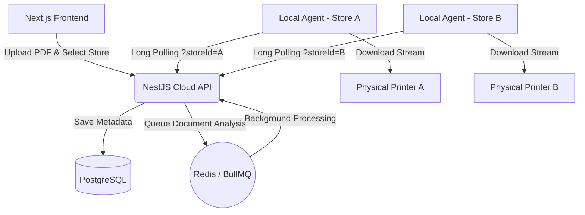

# PrintPanda 🐼🖨️ 
> A Multi-Tenant, Print-on-Demand Marketplace Platform

PrintPanda is a distributed, multi-tenant marketplace designed to connect local print shops with customers. Built with a modern microservices-inspired architecture, the platform handles dynamic file uploads, distributed document queues, and secure hardware-level printing execution across multiple geographic locations.

## 🏗 Architecture

The platform is split into three core microservices:

1. **Next.js Web Frontend (`apps/web`)**
   - A mobile-first, highly responsive web dashboard built with Tailwind CSS.
   - Features a seamless guest-checkout flow and live dynamic pricing based on physical shop selection.
2. **NestJS Cloud API (`apps/server`)**
   - A robust Node.js cloud backend powered by TypeScript, Prisma, and PostgreSQL.
   - Acts as the central router and queuing system using **BullMQ** and **Redis**.
   - Handles multi-tenant routing, ensuring shop data is sandboxed via strict foreign key constraints.
3. **Local Hardware Agent (`apps/local-agent`)**
   - A lightweight Node.js worker designed to run securely on a partner shop's physical Windows machine.
   - Constantly polls the cloud API for jobs assigned to its specific `STORE_ID`.
   - Downloads binary PDF streams and automatically executes native PowerShell spooling commands to drive local physical printers.



## 🚀 Tech Stack
- **Frontend:** Next.js 14, React, Tailwind CSS, Lucide Icons.
- **Backend:** NestJS, TypeScript, BullMQ, Express.
- **Database:** PostgreSQL, Prisma ORM, Redis.
- **Infrastructure:** Docker Compose, Node.js `child_process`.

## 🛠 Getting Started

### 1. Boot Infrastructure
Ensure Docker Desktop is running, then boot the database and Redis cache:
```bash
docker-compose up -d
```

### 2. Start the Cloud Backend
```bash
cd apps/server
npx prisma db push
npm run start:dev
```

### 3. Start the Hardware Agent Worker
```bash
cd apps/local-agent
npm install
npm run start
```

### 4. Start the Frontend
```bash
cd apps/web
npm install
npm run dev
```

## 🌟 Resume Highlights
- **Distributed Systems Design:** Successfully decoupled the web interface from hardware execution using an asynchronous BullMQ queuing architecture.
- **Multi-Tenant Security:** Engineered a strict relational database schema to sandbox client data across multiple partner locations.
- **Hardware Integration:** Bridged cloud web-apps with physical local hardware via native shell execution and stream processing.
